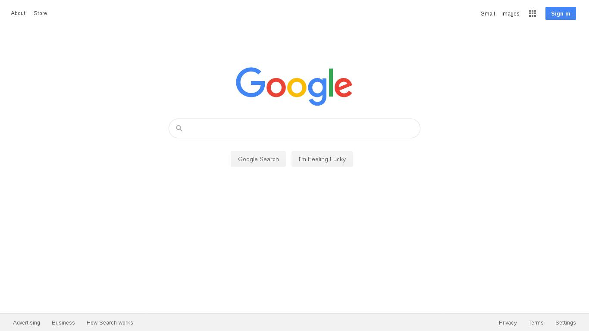

# Documentation

## API

### Get screenshot [POST]

Enter with url that you want to get the screenshot, and the options.

URL: http://YOUR-IP:5000/screenshot?token=TOKEN

#### Parameters:

Name | Type | Valid Values | Required | Default Value |
|---|---|---|---|---|
| url | string | valid urls | true | |
| options.fullPage | bool | false/true | true | |
| options.type | string | png, jpg, jpeg | true | |
| options.quality | int | [0, 100] | false | 100 |
| options.tor |  bool | false/true | true | false |
| options.timeout | int | [5, 60] | true | |
| options.browser | string | firefox, google-chrome | true | |
| options.height | int | [400, inf) | false | 600 |
| options.width | int | [400, 1920] | false | 800 |


#### Body:

```json
{
  "url": "https://google.com",
  "options": {
    "fullPage": true,
    "type": "jpeg",
    "quality": 75,
    "tor": false,
    "timeout": 15,
    "browser": "google-chrome",
    "height": 600,
    "width": 800
  }
}
```

#### Response:



